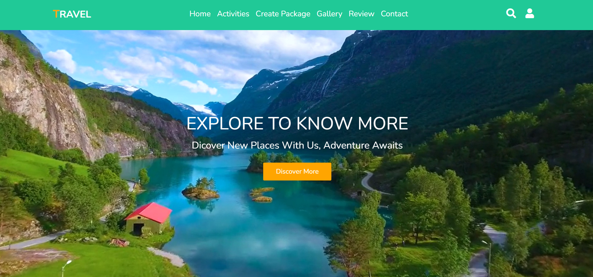
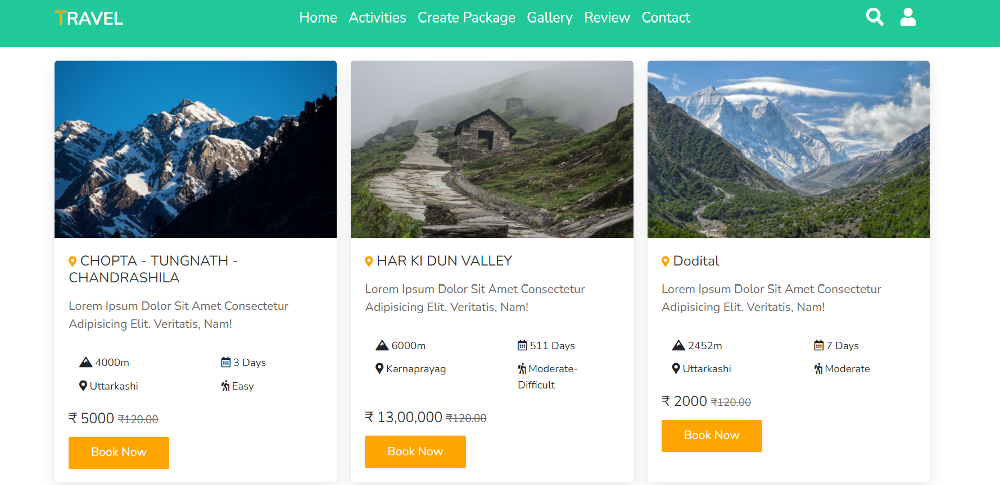
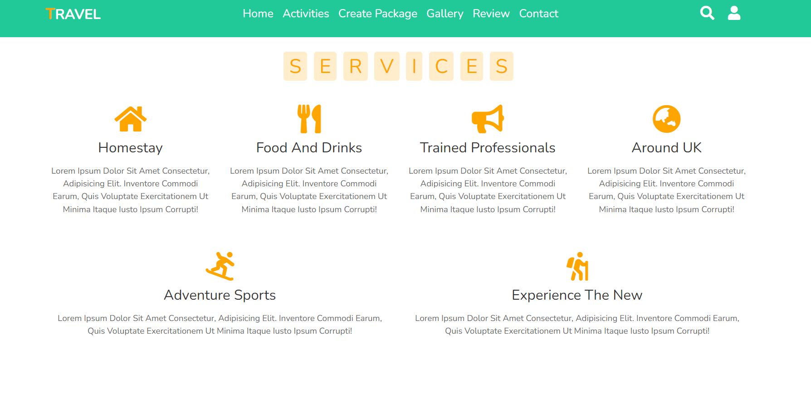
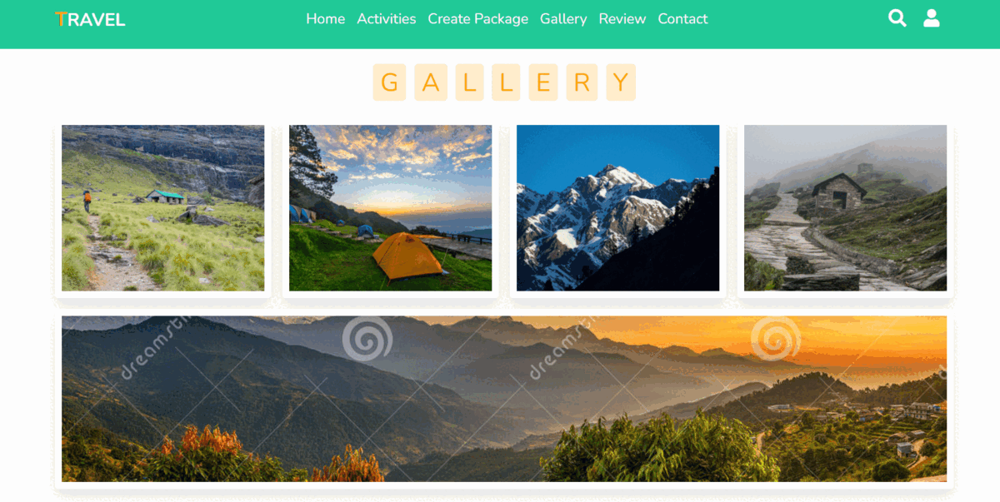
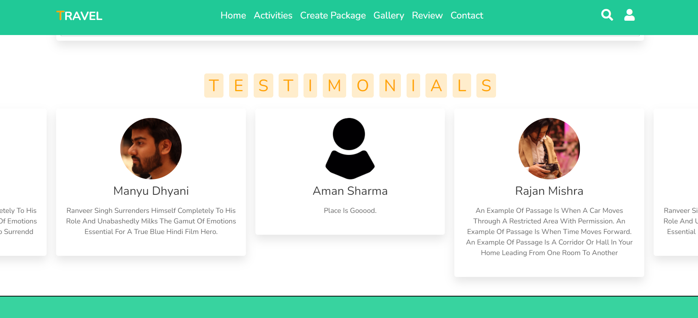
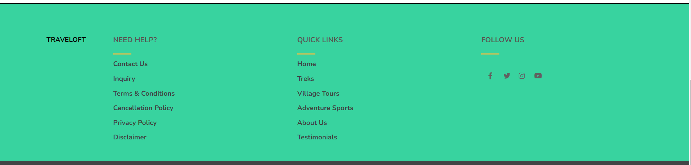
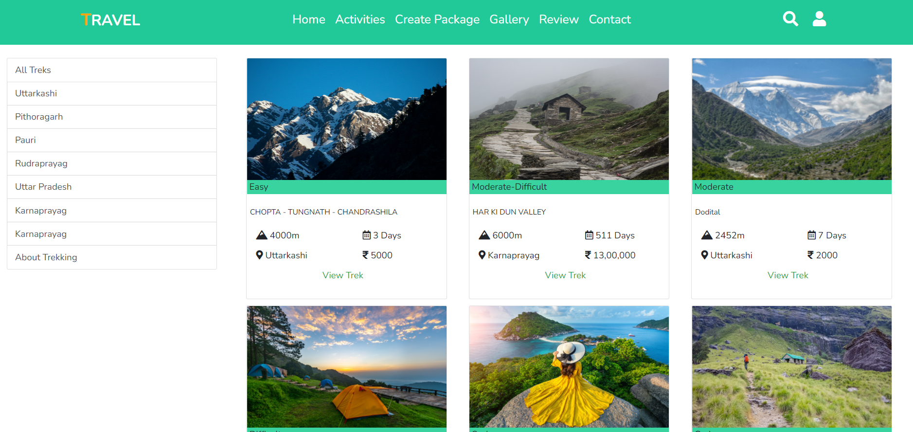
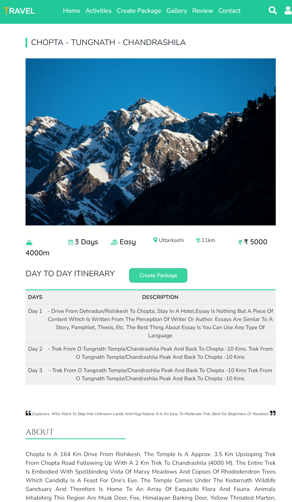
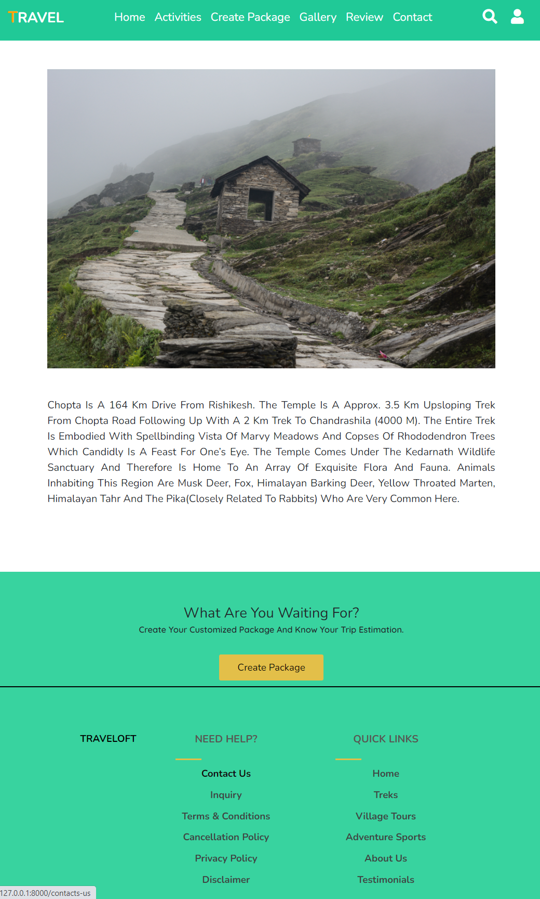
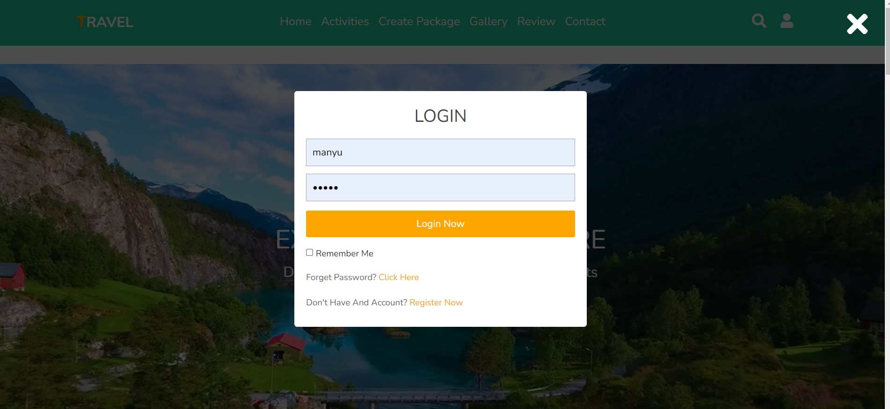

# Travel-Website

This is another freelance project I build for a Travel Company. The code for the site is free to use.  
The project has used Django framework for the backend along with HTML5, css and JS for frontend development.   
**Note:** The site pages are responsive and work perfectly with mobile and tablets too.  

This is the main page. First thing we can see is the welcome video landing page followed by trips, service, gallery and testimonials respectively. The image below depict the content of the landing page as we scroll down the site.
The last image shows the footer for the site. User can also make a search for the treks and village tours in the site.

Every section in the landing page has its own section. The treks can be seen and filtered by district they are situated. The same goes for village tours and Gallery.  

Every treks, village tours or adventure sports has its own detail page.

The create Package page allows the user to create the custom package for there trip. There is also a upcoming event page for listing all future events company going to host.  

User can also login and write articles and testimonials.

**Note:** As this is an old project no editor is integrated for writing article or any other page details. My all new projects like Hashstrix (you can find it in my repo) has CKEditor. The editor is always recommended as it increase user interaction with the product.
